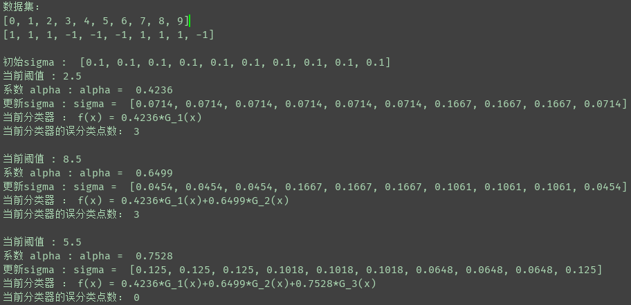

## AdaBoost(提升方法)

源码查看 : [AdaBoost.py](AdaBoost.py)  
 
训练数据集：[data.txt](data.txt) 

***

AdaBoost从训练数据集学习一系列弱分类器或基本分类器，然后将这些弱分类器组合成一个强分类器，这是一个有趣且大有用处的算法。 

**AdaBoost算法** 
输入：数据集 T = {(x1,y1),...,(xN,yN)},其中x&in;R, y = {-1,+1} 
输出：弱学习算法  
(1)初始化训练数据的权值： 
&emsp;&emsp;&omega; = (1/N,....,1/N), &omega;的长度为N 
(2)对 m = 1,2,....,M 
&emsp;&emsp;(a)使用带有权值分布的&omega;进行学习，得到基本分类器： 
&emsp;&emsp;&emsp;&emsp;G_m(x) : &chi; --> {-1, 1} 
&emsp;&emsp;(b)计算G_m(x)在训练数据集上的分类误差率： 
&emsp;&emsp;&emsp;&emsp;&varrho;_m = P(G_m(xi)!=yi) = sum_{i=1}^N( &omega;_mi \* I(G_m(xi)!=yi) )  
&emsp;&emsp;(c)计算G_m(x) 的系数: 
&emsp;&emsp;&emsp;&emsp;&alpha; = 1/2 \* log( (1 - &varrho;_m)/&varrho;_m )  
&emsp;&emsp;(d)更新训练集的权值分布： 
&emsp;&emsp;&emsp;&emsp; &omega;_i = (&omega;_i / Z_m) \* exp(-&alpha;_m \* yi \* G_m(xi)) , i = 1,2,...,N  
&emsp;&emsp;Z_m是规范化因子：  
&emsp;&emsp;&emsp;&emsp;Z_m = sum_{i=1}^N( &omega;_mi \* exp(-&alpha;_m \* yi \* G_m(xi)) )  
(3)构建基本分类器的线性组合： 
&emsp;&emsp;f(x) = sum_{m=1}^M( &alpha;_m \* G_m(x))  
 
得到最终分类器： 
&emsp;&emsp;G(x) = sign(f(x)) = sign(sum_{m=1}^M (&alpha;_m \* G_m(x)))  
 

***
运行结果：

